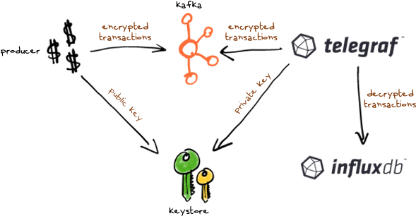

# Can you help John?

## Overview

John works in a bank and wants to visualize the average amount of each transaction over time using InfluxDB. 

Here is a sample transaction: 

```
transfer,sender=Alice,receiver=Bob amount=28.00 1591644525765
```

However, messages are sent to Kafka encrypted with the public key of the bank.
Extend telegraf in order to decrypt every transaction and upload the corresponding measurement to InfluxDB.

## Details



Start the `docker-compose.yml`

```
docker-compose up -d
```

and wait 2 minutes.

The `producer` component produces sample transactions. The transactions are encrypted using the public key avalilable at `keystore/public.pem`. Finally the encrypted transactions are sent to Kafka.

A sample `decoder` written in python is provided.

## Todo

In order to help John, you should:

- Create an extension of [Telegraf](https://github.com/influxdata/telegraf), with a Telegraf parser plugin that, given an encrypted message, is able to decrypt it with a given private key, and convert it into a telegraf metric. I suggest you to make the new version available as Docker Image.
- Complete the file `docker-compose-influx.yml` with the extended version of Telegraf and InfluxDB.
- Run your solution.
```
docker-compose -f docker-compose-influx.yml up -d
```

Once you have your solution working, open a Pull Request 😁
